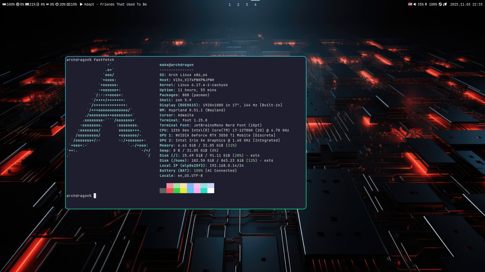

# Maks's dotfiles

I use Hyprland + Waybar

### Dependencies

 - hyprland
 - hyprpaper (for wallpapers)
 - waybar
 - dunst (or any other notification manager)

 For some scripts also needed:  
 - jq
 - bc
 - brightnessctl (for manage display and keyboard brightness)
 - nvidia-smi (only if you have nvidia gpu and want to show it status in waybar)

### Licence

 IDontCareLicense  
 (C) Maks Makuta  
 2025  

